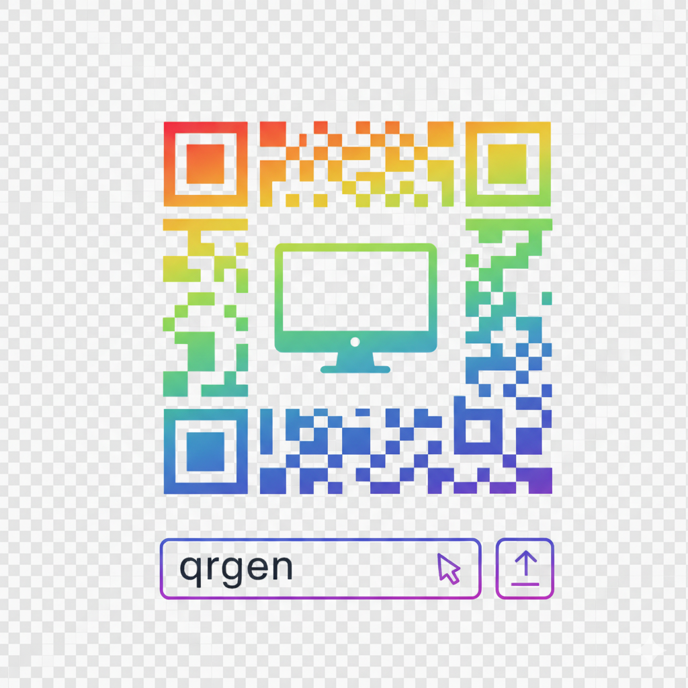

# QRGen - QR Code Generator CLI
<div align="left">
  
</div>
A simple, powerful command-line tool for generating QR codes from text, URLs, or any data.

## Features

- Generate QR codes from any text or URL
- Save as PNG images
- Display QR codes directly in the terminal using ASCII art
- Customize size, border, and error correction levels
- Simple and intuitive command-line interface

## Installation

### From source

```bash
# Clone or navigate to the repository
cd qrgen

# Install the package
pip install -e .
```

### Requirements

- Python 3.7 or higher
- pillow (for image generation)
- qrcode (for QR code generation)

## Usage

### Basic Examples

```bash
# Generate a QR code for a URL (saves to qr_code.png by default)
qrgen "https://example.com"

# Generate with custom output filename
qrgen "Hello World" -o my_qr.png

# Display QR code in terminal
qrgen "https://github.com" --terminal

# Display in terminal AND save to file
qrgen "Contact: john@example.com" -o contact.png --terminal

# Customize size and error correction
qrgen "https://example.com" -o big_qr.png --size 15 --error-correction H
```

### Command-line Options

```
usage: qrgen [-h] [-o OUTPUT] [-s SIZE] [-b BORDER]
             [-e {L,M,Q,H}] [-t] data

Arguments:
  data                  The data to encode in the QR code (text, URL, etc.)

Options:
  -h, --help            Show help message
  -o, --output OUTPUT   Output file path (PNG format, default: qr_code.png)
  -s, --size SIZE       Size of each box in pixels (default: 10)
  -b, --border BORDER   Border size in boxes (default: 4)
  -e, --error-correction {L,M,Q,H}
                        Error correction level:
                          L (7% recovery)
                          M (15% recovery) - default
                          Q (25% recovery)
                          H (30% recovery)
  -t, --terminal        Display QR code in terminal using ASCII
```

## Error Correction Levels

QR codes support different levels of error correction, allowing them to be read even if partially damaged:

- **L (Low)**: Recovers up to 7% of data
- **M (Medium)**: Recovers up to 15% of data (default)
- **Q (Quartile)**: Recovers up to 25% of data
- **H (High)**: Recovers up to 30% of data

Higher error correction means the QR code can sustain more damage but will be larger.

## Examples

### Generate a QR code for a website

```bash
qrgen "https://github.com"
# Output: qr_code.png
```

### Generate a vCard contact QR code

```bash
qrgen "BEGIN:VCARD
VERSION:3.0
FN:John Doe
TEL:+1234567890
EMAIL:john@example.com
END:VCARD" -o contact.png
```

### Quick preview in terminal

```bash
qrgen "Quick message" --terminal
```

### Large, high-quality QR code

```bash
qrgen "Important data" -o important.png --size 20 --error-correction H
```

## License

MIT License - feel free to use this tool for any purpose.

## Author

Dougie Richardson
