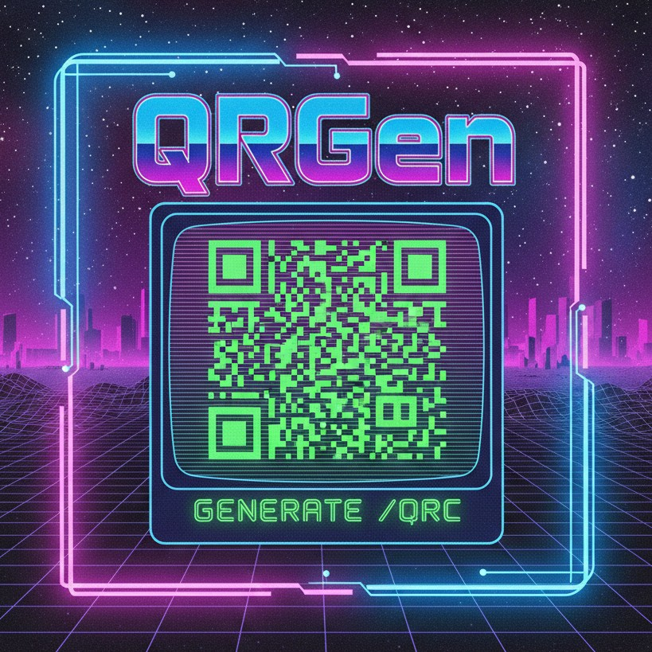

# QRGen - QR Code Generator CLI
<div align="left">
  
</div>
A simple, powerful command-line tool for generating QR codes from text, URLs, or any data.

## Features

- Generate QR codes from any text or URL
- Save as PNG images
- Display QR codes directly in the terminal using ASCII art
- Customize size, border, and error correction levels
- **Visual customization**: Custom colors and logo embedding
- **Content templates**: WiFi, vCard, SMS, email, and phone templates
- **Advanced QR types**: Support for Micro QR codes
- Simple and intuitive command-line interface

## Installation

### From source

```bash
# Clone or navigate to the repository
cd qrgen

# Install the package
pip install -e .
```

### Requirements

- Python 3.7 or higher
- pillow (for image generation)
- qrcode (for QR code generation)
- segno (for advanced QR code variants)

## Usage

### Basic Examples

```bash
# Generate a QR code for a URL (saves to qr_code.png by default)
qrgen "https://example.com"

# Generate with custom output filename
qrgen "Hello World" -o my_qr.png

# Display QR code in terminal
qrgen "https://github.com" --terminal

# Display in terminal AND save to file
qrgen "Contact: john@example.com" -o contact.png --terminal

# Customize size and error correction
qrgen "https://example.com" -o big_qr.png --size 15 --error-correction H

# Generate a colored QR code
qrgen "Colorful QR" -o colorful.png --fill-color blue --back-color yellow

# Add a logo to the QR code
qrgen "https://mycompany.com" -o branded.png --logo logo.png

# Create a WiFi QR code
qrgen "MyNetwork,mypassword,WPA" --template wifi -o wifi.png

# Generate a Micro QR code
qrgen "Small" -o micro.png --type micro
```

### Command-line Options

```
usage: qrgen [-h] [-o OUTPUT] [-s SIZE] [-b BORDER]
             [-e {L,M,Q,H}] [-t] [--fill-color FILL_COLOR]
             [--back-color BACK_COLOR] [--logo LOGO]
             [--type {standard,micro}]
             [--template {wifi,vcard,sms,email,phone}]
             data

Arguments:
  data                  The data to encode in the QR code (text, URL, etc.)

Options:
  -h, --help            Show help message
  -o, --output OUTPUT   Output file path (PNG format, default: qr_code.png)
  -s, --size SIZE       Size of each box in pixels (default: 10)
  -b, --border BORDER   Border size in boxes (default: 4)
  -e, --error-correction {L,M,Q,H}
                        Error correction level:
                          L (7% recovery)
                          M (15% recovery) - default
                          Q (25% recovery)
                          H (30% recovery)
  -t, --terminal        Display QR code in terminal using ASCII
  --fill-color COLOR    Fill color for QR modules (default: black)
  --back-color COLOR    Background color (default: white)
  --logo PATH           Path to logo image to embed in center
  --type TYPE           QR code type: standard or micro (default: standard)
  --template TYPE       Use template: wifi, vcard, sms, email, or phone
```

## Error Correction Levels

QR codes support different levels of error correction, allowing them to be read even if partially damaged:

- **L (Low)**: Recovers up to 7% of data
- **M (Medium)**: Recovers up to 15% of data (default)
- **Q (Quartile)**: Recovers up to 25% of data
- **H (High)**: Recovers up to 30% of data

Higher error correction means the QR code can sustain more damage but will be larger.

## Visual Customization

### Custom Colors

You can customize the QR code colors using `--fill-color` and `--back-color` options:

```bash
# Blue QR code on white background
qrgen "https://example.com" -o blue_qr.png --fill-color blue

# Dark green on light yellow
qrgen "Custom colors" -o custom.png --fill-color darkgreen --back-color lightyellow

# Using hex colors
qrgen "Hex colors" -o hex.png --fill-color "#FF5733" --back-color "#C70039"
```

### Logo Embedding

Add a logo or image to the center of your QR code using the `--logo` option:

```bash
# Add company logo
qrgen "https://mycompany.com" -o branded.png --logo company_logo.png

# With high error correction (recommended for logos)
qrgen "https://example.com" -o logo_qr.png --logo logo.png --error-correction H
```

**Note**: When embedding logos, use high error correction (H) to ensure the QR code remains scannable even with the logo covering part of the code.

## Content Templates

Generate QR codes for common use cases with built-in templates:

### WiFi QR Code

```bash
# Format: SSID,password,encryption
qrgen "MyNetwork,mypassword123,WPA" --template wifi -o wifi.png

# Or use interactive mode (just provide any text)
qrgen "wifi" --template wifi -o wifi.png
# You'll be prompted for network details
```

### vCard (Contact Card)

```bash
# Format: name,phone,email,organization
qrgen "John Doe,+1234567890,john@example.com,Acme Corp" --template vcard -o contact.png

# Or use interactive mode
qrgen "contact" --template vcard -o contact.png
```

### SMS

```bash
# Format: phone_number,message
qrgen "1234567890,Hello there!" --template sms -o sms.png
```

### Email

```bash
# Format: email,subject,body
qrgen "contact@example.com,Hello,Message body" --template email -o email.png
```

### Phone Number

```bash
qrgen "1234567890" --template phone -o phone.png
```

## Advanced QR Code Types

### Micro QR Codes

Micro QR codes are smaller versions of standard QR codes, suitable for applications with limited space:

```bash
# Generate a Micro QR code
qrgen "Hello" -o micro.png --type micro

# Micro QR with custom colors
qrgen "Small QR" -o colored_micro.png --type micro --fill-color red
```

**Note**: Micro QR codes have limited data capacity compared to standard QR codes and only support error correction levels L, M, and Q (H is automatically downgraded to Q). They're best for short messages or URLs.

## Examples

### Generate a QR code for a website

```bash
qrgen "https://github.com"
# Output: qr_code.png
```

### Generate a vCard contact QR code (using template)

```bash
qrgen "John Doe,+1234567890,john@example.com,Acme Corp" --template vcard -o contact.png
```

### Quick preview in terminal

```bash
qrgen "Quick message" --terminal
```

### Large, high-quality QR code with logo

```bash
qrgen "Important data" -o important.png --size 20 --error-correction H --logo mylogo.png
```

### Colored QR code for branding

```bash
qrgen "https://mybrand.com" -o branded.png --fill-color "#003366" --back-color "#FFCC00"
```

## License

MIT License - feel free to use this tool for any purpose.

## Author

Dougie Richardson
